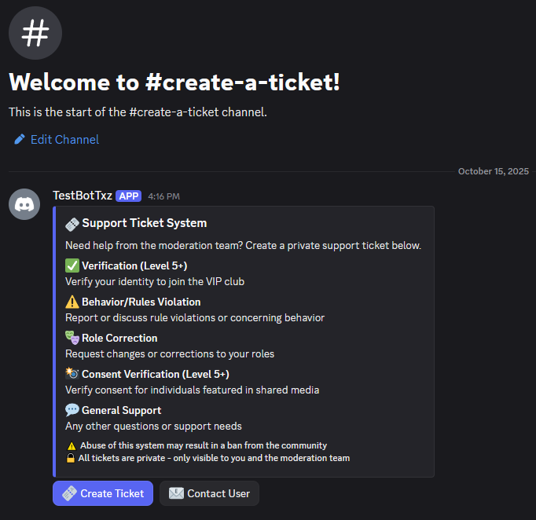
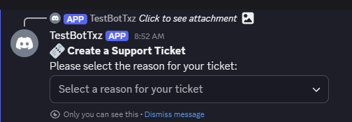
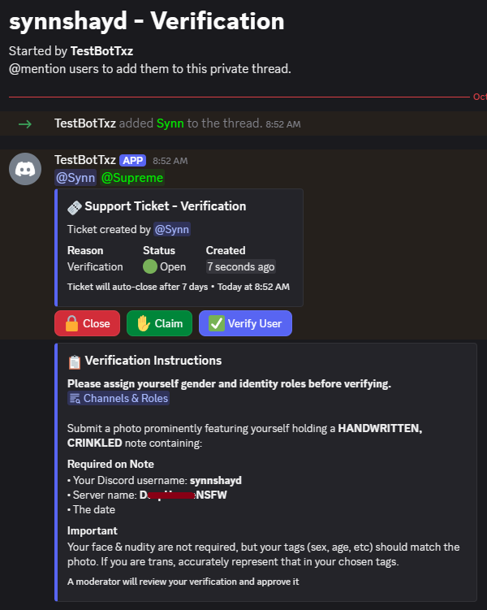
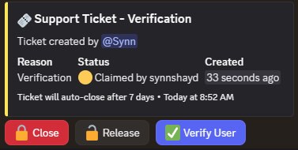
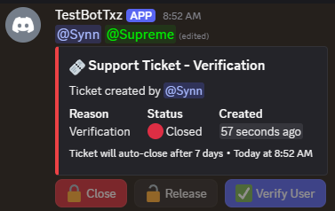

# Private Support System Tickets (Psst)

A Discord ticket system for managing user verifications, moderation communications, and support requests through private threads with full data persistence.

## Screenshots

<details>
<summary>Click to see the bot in action</summary>

### Ticket Panel

*The main ticket panel with all available ticket reasons*

### Creating a Ticket

*User-friendly dropdown menu for selecting ticket reason*

### Verification Ticket Thread

*Private thread with automatic verification instructions*

### Claimed Ticket

*Ticket status updates when a moderator claims it*

### Closed Ticket

*Final ticket status after resolution*

</details>

## Key Features

### 🎫 Ticket Management
- **Private Threads**: All tickets handled in private, confidential threads
- **Dropdown Selection**: Users select from predefined ticket reasons
- **Level Requirements**: Verification tickets require Level 5+
- **Auto-Close**: Tickets automatically close after 7 days of inactivity
- **Status Tracking**: Real-time status updates (🟢 Open, 🟡 Claimed, 🔴 Closed)
- **Smart Cleanup**: Empty/auto-closed tickets are deleted; resolved tickets are archived

### 🛡️ Moderation Features
- **Claim System**: Moderators can claim tickets for one-on-one support
- **Quick Verify**: Special button for verification tickets to add verified role
- **Add Members**: `/add <user>` slash command to safely add users (moderator-only)
- **Tag Protection**: Prevents unauthorized member additions via mentions
- **Content Archival**: Automatically preserves user-deleted attachments

### 💾 Data Persistence
- Automatic save to `tickets.json`
- Full recovery after bot restarts
- Ticket age tracking persists across downtime

## Installation

1. **Install Dependencies**
   ```bash
   npm install
   ```

2. **Configure the Bot**
   
   Copy the example configuration:
   ```bash
   cp config.js.example config.js
   ```
   
   Edit `config.js` with your values:
   ```javascript
   token: 'YOUR_BOT_TOKEN'
   moderatorRoleName: 'Moderator'
   verifiedRoleName: 'Verified'
   ```

   **Roles:** The bot looks up the moderator and verified roles by name at runtime, so just make sure roles with these names exist in your server. The ticket channel is configured later with `/setup-tickets`.

   **⚠️ Security:** `config.js` is gitignored and should never be committed!

3. **Set Bot Role Hierarchy**
   - Go to Server Settings → Roles
   - Drag bot's role **above** the Verified role
   - Required for the verify button to work

4. **Start the Bot**
   ```bash
   npm start
   ```

5. **Initialize Ticket Panel**
   - Run `/setup-tickets` in the channel you want to use for tickets
   - Bot will auto-configure permissions, create the panel, and remember that channel

## Usage

### For Users

**Creating a Ticket:**
1. Click "Create Ticket" button
2. Select your reason from dropdown
3. A private thread will be created
4. Communicate with moderators in the thread
5. Click "Close" when done

**Ticket Reasons:**
- **Verification** (Level 5+ required) - Identity verification
- **Behavior/Rules Violation** - Report rule violations
- **Role Correction** - Request role changes
- **Consent Verification** (Level 5+ required) - Verify consent for shared media
- **General Support** - Any other support needs

### For Moderators

**Ticket Actions:**
- **Claim** - Take ownership (removes other moderators from thread)
- **Release** - Return claimed ticket to queue (adds all moderators back)
- **Close** - Archive and lock the ticket
- **Verify User** - Add verified role (verification tickets only)

**Commands:**
- `/setup-tickets` - Set the current channel as the ticket channel and post the panel (Admin only)
- `/add <user>` - Add user to ticket thread (in tickets)

**Creating Tickets for Users:**
1. Click "Contact User" button
2. Enter username or user ID
3. Select reason
4. Ticket is auto-created and claimed by you

## Ticket Lifecycle

1. **Created** (🟢 Open) - User creates ticket or moderator contacts user
2. **Claimed** (🟡) - Optional: Moderator claims for dedicated support
3. **Released** (🟢) - Optional: Returned to queue for any moderator
4. **Closed** (🔴) - Manually closed (archived) or auto-closed after 7 days (deleted)

**Note:** All users are removed from closed tickets to prevent post-closure edits.

## Configuration

In `config.js`:

```javascript
{
    token: 'YOUR_BOT_TOKEN',
    moderatorRoleName: 'Moderator',
    verifiedRoleName: 'Verified',
    autoCloseAfterDays: 7
}
```

The ticket channel is not stored in `config.js`. It is set per-server with `/setup-tickets` and persisted in `settings.json`.

## Bot Permissions

Required permissions: View Channels, Send Messages, Manage Messages, Embed Links, Read Message History, Manage Channels, Manage Roles, Manage Threads, Create Private Threads, Send Messages in Threads

**Permission Integer**: `361045779472`

## Advanced Features

### Level System Integration
- Scans user roles for "Level X" format
- Works with MEE6, Amari, or any leveling bot
- Verification/Consent Verification require Level 5+

### Auto-Instructions
Verification and Consent Verification tickets automatically receive detailed instructions with:
- Pre-filled username and server name
- Verification photo requirements
- Handwritten, crinkled note requirements
- Deadlines and consequences

### Content Preservation
- Archives user-deleted attachments automatically
- Displays in "📎 Archived Attachments" section
- Moderator deletions are exempt (for cleanup)

### Thread Privacy
- Private threads with invite disabled
- Only moderators can add members via `/add`
- Tag protection prevents unauthorized additions

## Troubleshooting

**Bot doesn't respond**
- Check bot is online and token is correct
- Verify bot has proper permissions

**Can't create private threads**
- Server needs Level 2 boost or higher
- Bot needs "Create Private Threads" permission

**Verify button error**
- Bot's role must be ABOVE Verified role in Server Settings → Roles

**Tickets not persisting**
- Check console for `tickets.json` errors
- Ensure bot has write permissions in its directory

## File Structure

```
Psst/
├── bot.js              # Main bot code
├── config.js           # Configuration (gitignored)
├── config.js.example   # Configuration template
├── package.json        # Dependencies
├── tickets.json        # Ticket data (auto-created, gitignored)
├── settings.json       # Per-guild settings, e.g. ticket channel (auto-created)
├── screenshots/        # Example screenshots
├── README.md           # Documentation
├── SETUP_GUIDE.md      # Quick setup guide
└── LICENSE             # MIT License
```

## License

MIT License - See LICENSE file for details

---

**Built with Discord.js v14** | **Private Threads** | **Full Data Persistence**
